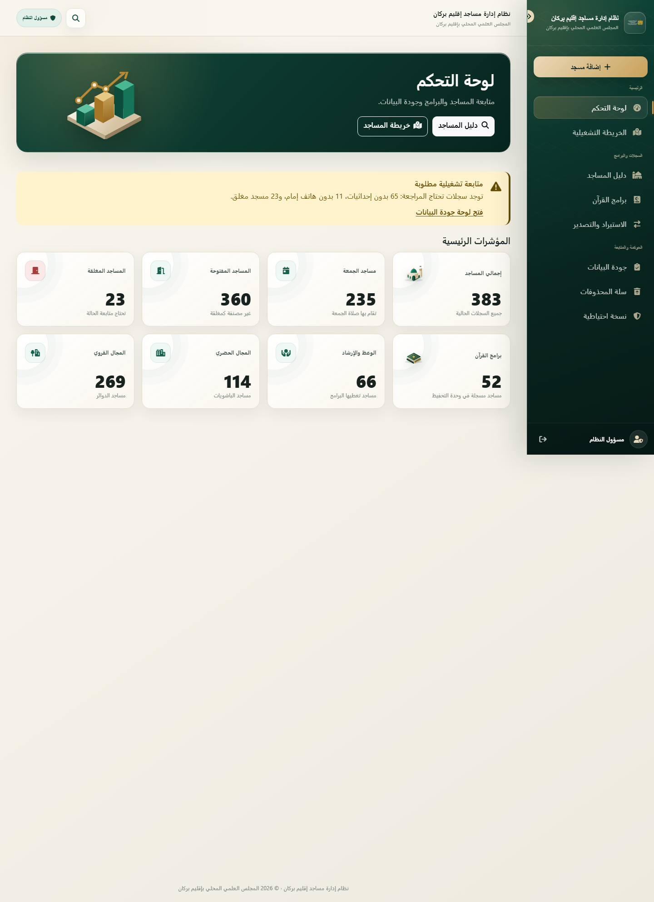
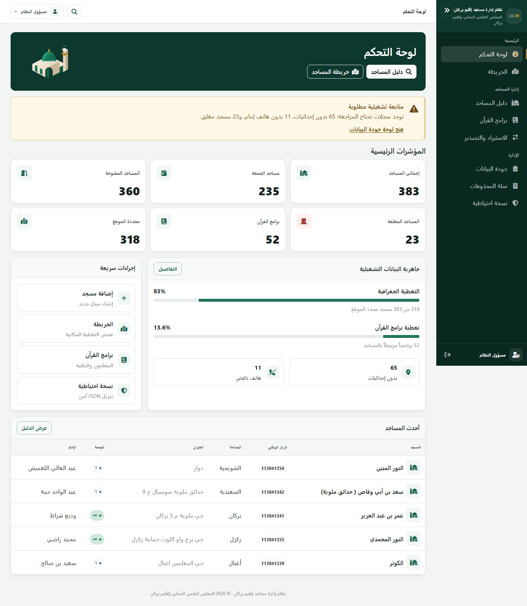
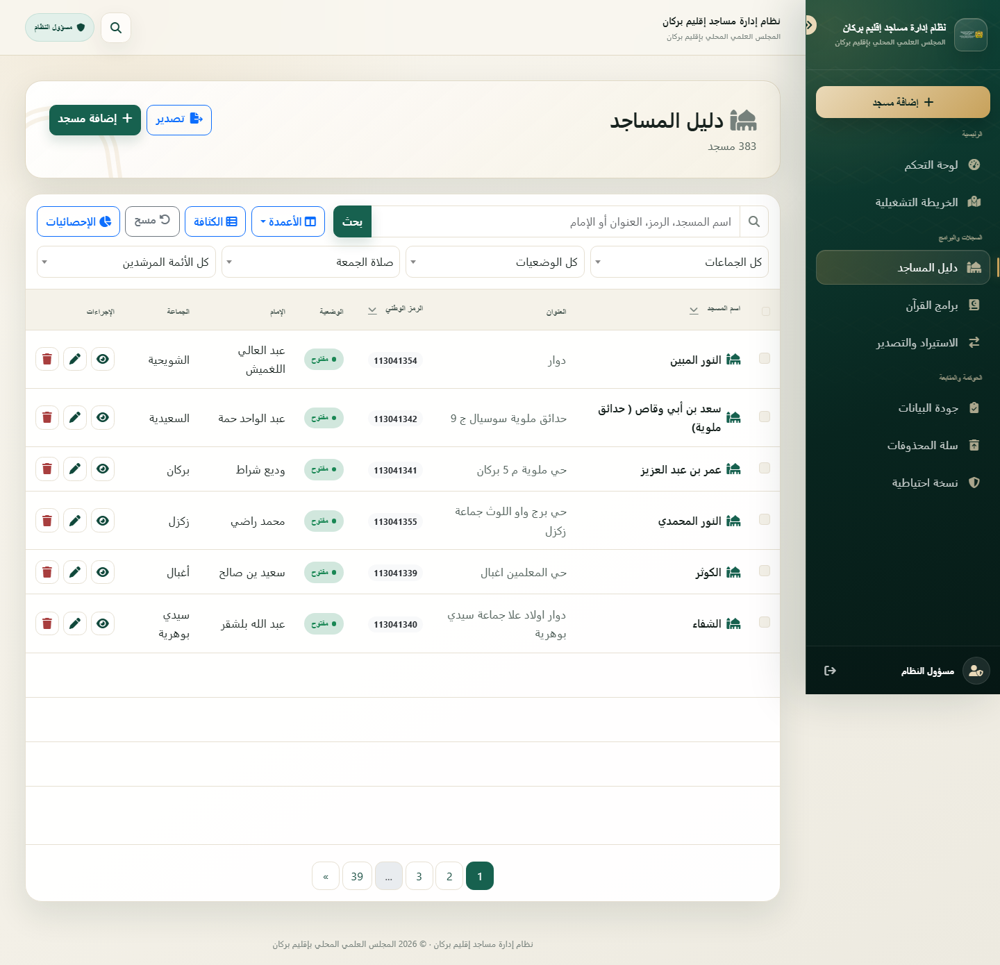
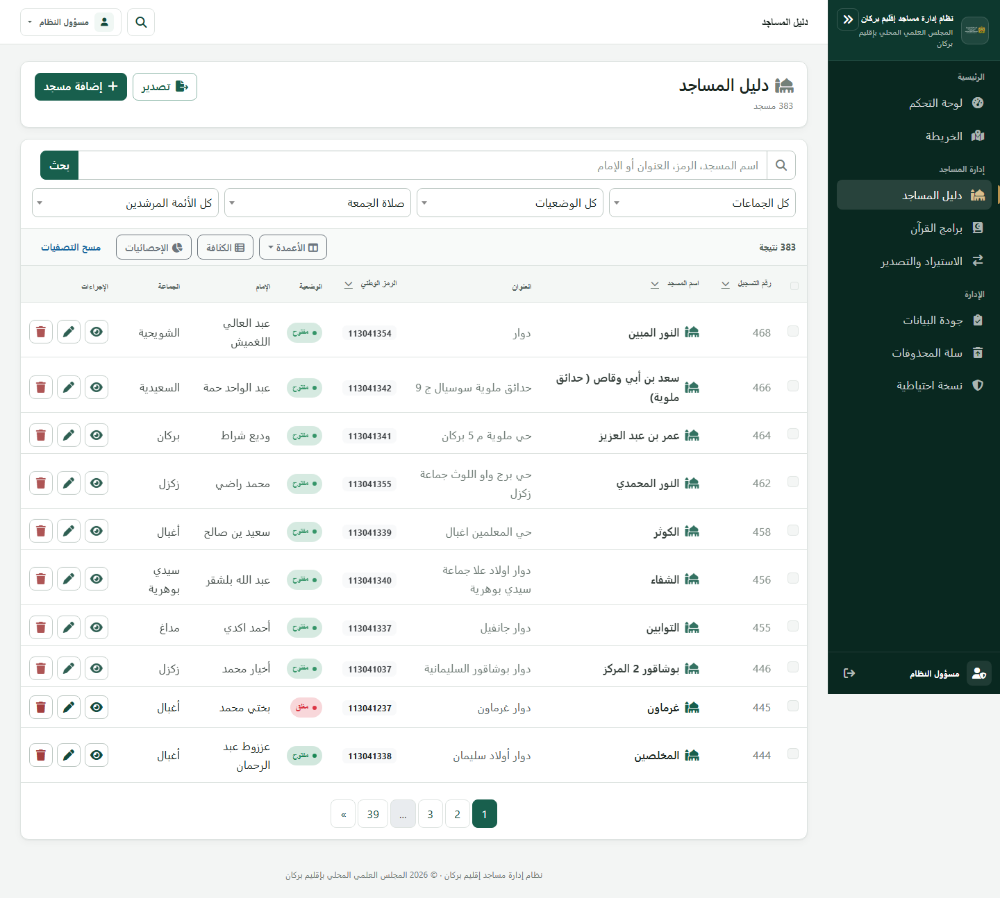
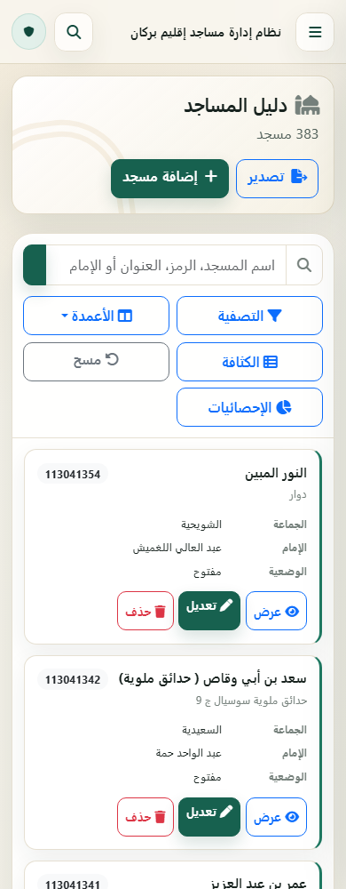
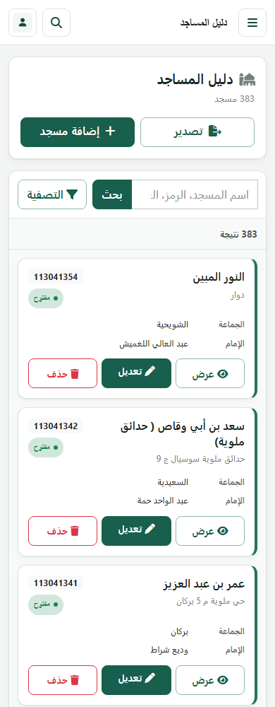
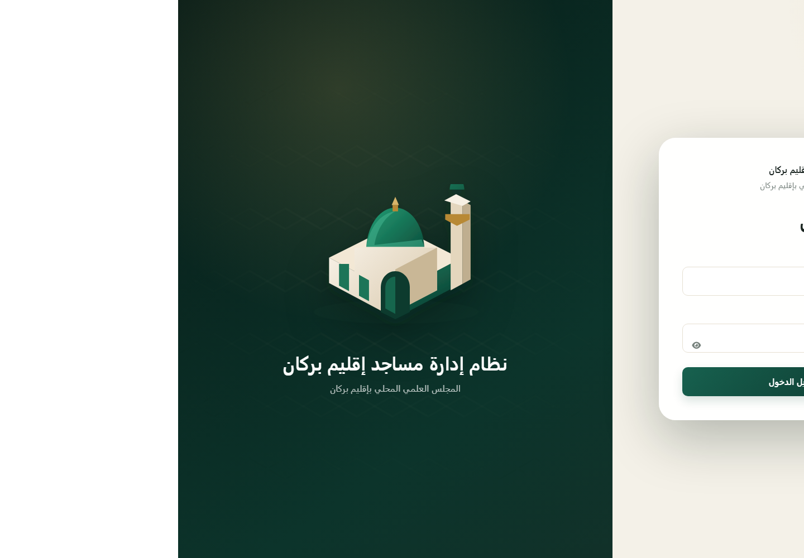
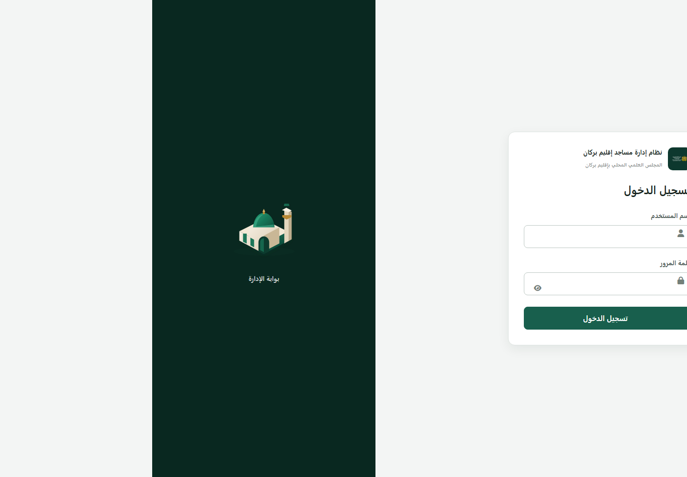

# UI Reset V2 — تقرير التحقق

## النطاق

- المستودع: `MarAb9/mosques_management`
- الفرع: `fix/ui-reset-v2`
- التطبيق المختبر: `http://127.0.0.1:8085`
- النطاق المنفذ: طبقة العرض فقط، مع أدوات تحقق متصفح مستقلة.
- لم تتغير قاعدة البيانات أو المتحكمات أو الخدمات أو المستودعات أو الوسائط أو المسارات أو الصلاحيات أو CSRF أو أسماء الحقول أو صيغ AJAX أو الاستيراد والتصدير.

## النتيجة

أعيد بناء الواجهة كنظام إدارة عربي RTL مؤسساتي مدمج: خلفية محايدة، أسطح بيضاء، أخضر داكن كلون أساسي، ذهب كلون إبراز محدود، وشريط جانبي بعرض 248px يطوى إلى 76px. أزيل الرسم البياني ثلاثي الأبعاد الكبير، وأصبحت لوحة التحكم مبنية حول البيانات الفعلية. أعيد تنظيم دليل المساجد إلى رأس مدمج، بحث وتصفيات، شريط أدوات مستقل، جدول سطح مكتب، وبطاقات هاتف مدمجة.

## قبل وبعد

### لوحة التحكم

| قبل | بعد |
|---|---|
|  |  |

### دليل المساجد

| قبل | بعد |
|---|---|
|  |  |

### الهاتف

| قبل | بعد |
|---|---|
|  |  |

### تسجيل الدخول

| قبل | بعد |
|---|---|
|  |  |

## المشاكل التي عولجت

| المشكلة | المعالجة |
|---|---|
| شريط جانبي بعرض 280px ومؤثرات بصرية قوية | عرض 248px، طي إلى 76px، خلفية مؤسساتية ثابتة، مؤشر نشط واحد، وتسميات أصلية عند الطي عبر `title`. |
| تكرار اسم المؤسسة في الشريط العلوي | يعرض الشريط العلوي عنوان الصفحة فقط مع البحث والتحكم في الحساب. |
| رسم إحصائي ثلاثي الأبعاد كبير | أزيل كلياً واستبدل بعنصر مسجد مساعد بعرض 160px داخل رأس لا يتجاوز 176px. |
| أسطح بيج وتدرجات وحاويات كبيرة | خلفية رمادية فاتحة، أسطح بيضاء، حدود خفيفة، زوايا 8–14px، وظلال محدودة. |
| ثمانية مؤشرات كبيرة مع نصوص طويلة | ست بطاقات بيانات بارتفاع يقارب 120px، رقم واضح، تسمية قصيرة، وأيقونة 40px. |
| أدوات دليل المساجد مزدحمة في صف البحث | فصل البحث والتصفيات عن شريط الجدول: عدد النتائج يميناً، والأعمدة والكثافة والإحصائيات ومسح التصفيات يساراً. |
| رقم التسجيل مخفي افتراضياً | أصبح ضمن أعمدة سطح المكتب الافتراضية، وبقيت الجمعة والسنة والإمام المرشد والموقع اختيارية. |
| قائمة الأعمدة غير مضمونة داخل الشاشة | Bootstrap Popper مع حدود viewport؛ القياس النهائي 373–589px داخل viewport بعرض 1440px. |
| عرض عدد تحديد يساوي صفراً | منطقة التحديد مخفية بالكامل عند الصفر وتظهر فقط عند اختيار سجلات. |
| بطاقات الهاتف وتحكماته طويلة أو متراكمة | بطاقات 193–199px في العروض 360/390/430، وفلتر واحد يفتح لوحة مطوية. |
| البحث العام لا يفتح الحوار داخل صفحة الدليل | يفتح الحوار من كل صفحة مصادق عليها، يركز الحقل، ينتقل إلى `mosques.php?query=...`، يغلق بـ Escape، ويعيد التركيز إلى زر البحث. |
| تجاوز أفقي للجدول عند 1280 و1024 | إضافة احتواء `min-width: 0` لمسار grid وscroll داخلي للجدول؛ النتيجة صفر تجاوز في جميع العروض. |
| زران بلا اسم وصول في الخريطة | إضافة `aria-label` و`title` لمسح البحث وتحديث الخريطة. |
| شريط حفظ نماذج المسجد كان يطفو فوق منتصف النموذج | أصبح في نهاية النموذج بوضع ثابت في التدفق الطبيعي. |
| عناصر `reveal` أسفل الطية كانت مخفية في اللقطة الكاملة | المحتوى ظاهر دائماً، والحركة القصيرة تحسين اختياري فقط مع احترام `prefers-reduced-motion`. |

## لقطات الصفحات المطلوبة

| الصفحة | سطح المكتب 1440 | الهاتف 390 |
|---|---|---|
| تسجيل الدخول | [login-1440](screenshots/ui-reset-v2/after/login-1440.png) | يغطي اختبار العرض 390 صفحة الدليل ولوحة التحكم، وتصبح صفحة الدخول عموداً واحداً عند نفس breakpoint. |
| لوحة التحكم | [dashboard-1440](screenshots/ui-reset-v2/after/dashboard-1440.png) | [dashboard-mobile-390](screenshots/ui-reset-v2/after/dashboard-mobile-390.png) |
| دليل المساجد | [mosques-1440](screenshots/ui-reset-v2/after/mosques-1440.png) | [mosques-mobile-390](screenshots/ui-reset-v2/after/mosques-mobile-390.png) |
| إضافة مسجد | [add-mosque-1440](screenshots/ui-reset-v2/after/add-mosque-1440.png) | [add-mosque-mobile-390](screenshots/ui-reset-v2/after/add-mosque-mobile-390.png) |
| تعديل مسجد | [edit-mosque-1440](screenshots/ui-reset-v2/after/edit-mosque-1440.png) | [edit-mosque-mobile-390](screenshots/ui-reset-v2/after/edit-mosque-mobile-390.png) |
| دليل القرآن | [quran-1440](screenshots/ui-reset-v2/after/quran-1440.png) | [quran-mobile-390](screenshots/ui-reset-v2/after/quran-mobile-390.png) |
| الخريطة | [map-1440](screenshots/ui-reset-v2/after/map-1440.png) | [map-mobile-390](screenshots/ui-reset-v2/after/map-mobile-390.png) |
| الاستيراد والتصدير | [import-export-1440](screenshots/ui-reset-v2/after/import-export-1440.png) | [import-export-mobile-390](screenshots/ui-reset-v2/after/import-export-mobile-390.png) |
| جودة البيانات | [data-quality-1440](screenshots/ui-reset-v2/after/data-quality-1440.png) | [data-quality-mobile-390](screenshots/ui-reset-v2/after/data-quality-mobile-390.png) |
| سلة المحذوفات | [trash-1440](screenshots/ui-reset-v2/after/trash-1440.png) | [trash-mobile-390](screenshots/ui-reset-v2/after/trash-mobile-390.png) |

## حالات دليل المساجد

- [الوضع العادي لسطح المكتب](screenshots/ui-reset-v2/after/mosques-1440.png)
- [قائمة الأعمدة مفتوحة](screenshots/ui-reset-v2/after/mosques-columns-open-1440.png)
- [ثلاثة صفوف محددة](screenshots/ui-reset-v2/after/mosques-selected-rows-1440.png)
- [تصفيات الهاتف مفتوحة](screenshots/ui-reset-v2/after/mosques-mobile-filters-390.png)
- [بطاقة مسجد على الهاتف](screenshots/ui-reset-v2/after/mosques-mobile-card-390.png)
- [الشريط الجانبي على الهاتف](screenshots/ui-reset-v2/after/mobile-sidebar-390.png)
- [تركيز حوار البحث العام](screenshots/ui-reset-v2/after/global-search-focus-1440.png)
- [إغلاق البحث بـ Escape واستعادة التركيز](screenshots/ui-reset-v2/after/global-search-escape-restored-1440.png)

## نتائج الاستجابة حسب العرض

تم تنفيذ الفحص `document.documentElement.scrollWidth === document.documentElement.clientWidth` لكل عرض. النتيجة: نجاح في جميع الحالات.

| العرض | لوحة التحكم | دليل المساجد | التجاوز الأفقي | ارتفاع أول بطاقة هاتف |
|---:|---|---|---|---:|
| 1920 | [لقطة](screenshots/ui-reset-v2/after/responsive-dashboard-1920.png) | [لقطة](screenshots/ui-reset-v2/after/responsive-mosques-1920.png) | لا يوجد | — |
| 1440 | [لقطة](screenshots/ui-reset-v2/after/responsive-dashboard-1440.png) | [لقطة](screenshots/ui-reset-v2/after/responsive-mosques-1440.png) | لا يوجد | — |
| 1280 | [لقطة](screenshots/ui-reset-v2/after/responsive-dashboard-1280.png) | [لقطة](screenshots/ui-reset-v2/after/responsive-mosques-1280.png) | لا يوجد | — |
| 1024 | [لقطة](screenshots/ui-reset-v2/after/responsive-dashboard-1024.png) | [لقطة](screenshots/ui-reset-v2/after/responsive-mosques-1024.png) | لا يوجد | — |
| 768 | [لقطة](screenshots/ui-reset-v2/after/responsive-dashboard-768.png) | [لقطة](screenshots/ui-reset-v2/after/responsive-mosques-768.png) | لا يوجد | 193px |
| 430 | [لقطة](screenshots/ui-reset-v2/after/responsive-dashboard-430.png) | [لقطة](screenshots/ui-reset-v2/after/responsive-mosques-430.png) | لا يوجد | 199px |
| 390 | [لقطة](screenshots/ui-reset-v2/after/responsive-dashboard-390.png) | [لقطة](screenshots/ui-reset-v2/after/responsive-mosques-390.png) | لا يوجد | 199px |
| 360 | [لقطة](screenshots/ui-reset-v2/after/responsive-dashboard-360.png) | [لقطة](screenshots/ui-reset-v2/after/responsive-mosques-360.png) | لا يوجد | 199px |

## نتائج DevTools

أداة `scripts/ui_reset_browser_audit.mjs` تشغل Chrome عبر DevTools Protocol، تسجل الأخطاء، تفحص الشبكة، تقرأ شجرة الوصول، تقيس الصناديق المحسوبة، وتلتقط الأدلة.

- حالات الصفحات المفحوصة: 35.
- حالات التفاعل المفحوصة: 7.
- اللقطات النهائية: 42.
- أخطاء أو تحذيرات console: 0.
- طلبات فاشلة أو استجابات HTTP 4xx/5xx: 0.
- أزرار بلا اسم وصول: 0.
- تجاوز أفقي للوثيقة: 0.
- البحث العام: التركيز انتقل إلى `globalSearchInput`، ثم عاد إلى `globalSearchToggle` بعد Escape.
- قائمة الأعمدة: بقيت داخل حدود viewport ولم تتجاوز الشاشة.

ملاحظة بيئية: `GOOGLE_MAPS_API_KEY` غير مضبوط في البيئة المحلية. لذلك تعرض صفحة الخريطة حالة الإعداد المدمجة بدلاً من تحميل Google Maps؛ لم ينتج عن ذلك طلب 404 أو خطأ console، وظلت قائمة المساجد ومرشحاتها متاحة.

## نتائج الاختبارات

| الأمر | النتيجة |
|---|---|
| `npm run build` | نجاح؛ CSS وJavaScript مبنيان ومصغران. |
| `node --check scripts/ui_reset_browser_audit.mjs` | نجاح. |
| `node --check public/assets/js/mosque.js` | نجاح. |
| `php tests/foundation_test.php` داخل Docker | 22 ناجح، 0 فاشل. |
| `php tests/guide_imams_test.php` داخل Docker | 9 ناجح، 0 فاشل. |
| `php tests/mosque_crud_http_test.php` داخل Docker | 31 ناجح، 0 فاشل. |
| `php tests/quran_http_test.php` داخل Docker | 33 ناجح، 0 فاشل. |
| `php tests/import_export_http_test.php` داخل Docker | 21 ناجح، 0 فاشل. |
| `bash tests/smoke_http.sh` داخل Docker | نجاح؛ الصفحات وAJAX والأصول العامة وسياسة CSP وحدود الملفات الخاصة اجتازت الفحص. |

المجموع: 116 assertion PHP ناجحاً، بالإضافة إلى مصفوفة HTTP smoke كاملة.

## الملفات التي تغيرت

### العرض والقوالب

- `resources/views/layouts/main.php`
- `resources/views/auth/login.php`
- `resources/views/dashboard/index.php`
- `resources/views/mosques/index.php`
- `resources/views/mosques/_row.php`
- `resources/views/mosques/create.php`
- `resources/views/mosques/edit.php`
- `resources/views/quran/index.php`
- `resources/views/quran/create.php`
- `resources/views/quran/edit.php`
- `resources/views/maps/index.php`
- `resources/views/import_export/index.php`

### نظام CSS

- `resources/css/foundation/tokens.css`
- `resources/css/foundation/base.css`
- `resources/css/layout/app-shell.css`
- `resources/css/components/components.css`
- `resources/css/effects/institutional-depth.css`
- `resources/css/pages/login.css`
- `resources/css/pages/dashboard.css`
- `resources/css/pages/workspaces.css`
- `resources/css/pages/quran.css`
- `resources/css/pages/records-responsive.css`
- `resources/css/pages/maps.css`

### التفاعل

- `resources/js/components/global-search.js`
- `resources/js/components/feedback.js`
- `resources/js/effects/motion.js`
- `public/assets/js/mosque.js`

### نواتج البناء والتحقق

- `public/assets/dist/app.min.css`
- `public/assets/dist/app.min.js`
- `scripts/ui_reset_browser_audit.mjs`
- `docs/screenshots/ui-reset-v2/before/*`
- `docs/screenshots/ui-reset-v2/after/*`
- `docs/UI_RESET_V2_REPORT.md`
